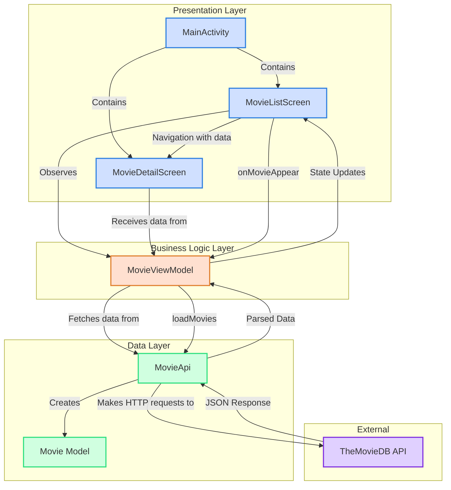

# MovieBrowserMVVM - Modern Android Movie Browser App

A modern Android app that displays popular movies using The Movie DB API. This project demonstrates Android development best practices using Jetpack Compose, MVVM architecture, and modern Android libraries.

## Features

- Display a paginated list of popular movies
- Auto-loading of additional movies when scrolling to the end of the list
- Detail view for each movie
- Modern UI using Jetpack Compose
- Navigation between screens
- Efficient image loading with Coil

## Architecture

The app follows the MVVM (Model-View-ViewModel) architecture pattern:

- **Model**: Represents the data layer with `Movie` data class and API handling
- **View**: Implemented with Jetpack Compose UI components (`MovieListScreen`, `MovieDetailScreen`)
- **ViewModel**: Manages UI-related data, handles business logic and communicates with the data layer

### Architecture Diagram

## Technology Stack

- **UI**: Jetpack Compose
- **Navigation**: Jetpack Navigation Compose
- **Network**: Retrofit for API calls
- **Image Loading**: Coil (equivalent to Kingfisher in iOS)
- **Async**: Kotlin Coroutines and Flow for asynchronous operations
- **Architecture**: MVVM with Repository pattern

## Project Structure

- `MainActivity.kt` - Entry point for the application, sets up navigation
- `MovieListScreen.kt` - Displays the list of movies
- `MovieDetailScreen.kt` - Shows detailed information about a selected movie
- `Model.kt` - Data classes for Movie and API response
- `MovieApi.kt` - API interface and implementation for The Movie DB API
- `MovieViewModel.kt` - ViewModel that manages UI state and business logic

## Setup Instructions

1. Clone the repository
2. Open the project in Android Studio
3. Build and run the app on an emulator or physical device

## Requirements

- Android Studio Hedgehog (2023.1.1) or newer
- Min SDK: 24 (Android 7.0)
- Target SDK: 34 (Android 14)

## Permissions

The app requires the following permissions:
- `android.permission.INTERNET` - To fetch movie data from the API

## API Key

The app uses The Movie DB API. The API key is included in the code for demonstration purposes, but in a real-world application, it should be stored securely.

## Future Improvements

- Implement caching for offline support
- Add search functionality
- Create a favorites section
- Enhance UI with animations and transitions
- Implement dependency injection with Hilt

## License

This project is open-source and available under the MIT License.